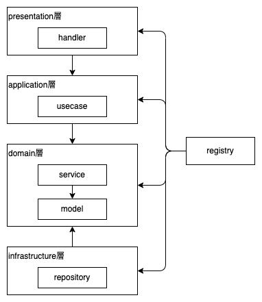

# JWTによる認証
## 概要
- ユーザー名、メールアドレス、パスワードでユーザーを登録してjwtを返す(サインアップ)
- メールアドレス、パスワードでログインしてjwtを返す(ログイン)
- jwtを検証してAPIレスポンスを返す
- DBとのやりとりがあるのでDockerを使う

# 簡易アーキ図


## 初回設定
- `.env.local` をコピーして `.env` を作成
```
cp .env.local .env
```
- APIサーバ立ち上げて検証の準備
```
# docker立ち上げ
docker compose up -d
docker compose exec app bash

# dockerコンテナ内で下記実行してサーバ起動
go run main.go
```

## API動作確認
```
# サインアップ(ユーザー登録)
curl -XPOST -H 'Content-Type: application/json' -d @signup.json localhost:8080/signup 
  or
curl -XPOST -H 'Content-Type: application/json' -d '{"user_name": "test1", "email": "sample2@mail.com", "password": "password"}' localhost:8080/signup

# ログイン
curl -XPOST -H 'Content-Type: application/json' -d @login.json localhost:8080/login
  or
curl -XPOST -H 'Content-Type: application/json' -d '{"email": "sample2@mail.com", "password": "password"}' localhost:8080/login

# jwt送信してリクエストの認証
curl -XPOST -H 'Content-Type: application/json' -d '{"token": "<responseのtoken>"}' localhost:8080/hello
```

## テスト・リンター動作確認
```
# テスト
make test

# リンター
make lint
```

# メモ
- レイヤードアーキテクチャで実装の練習
- `sqlc` でDB操作のインターフェースは自動生成
